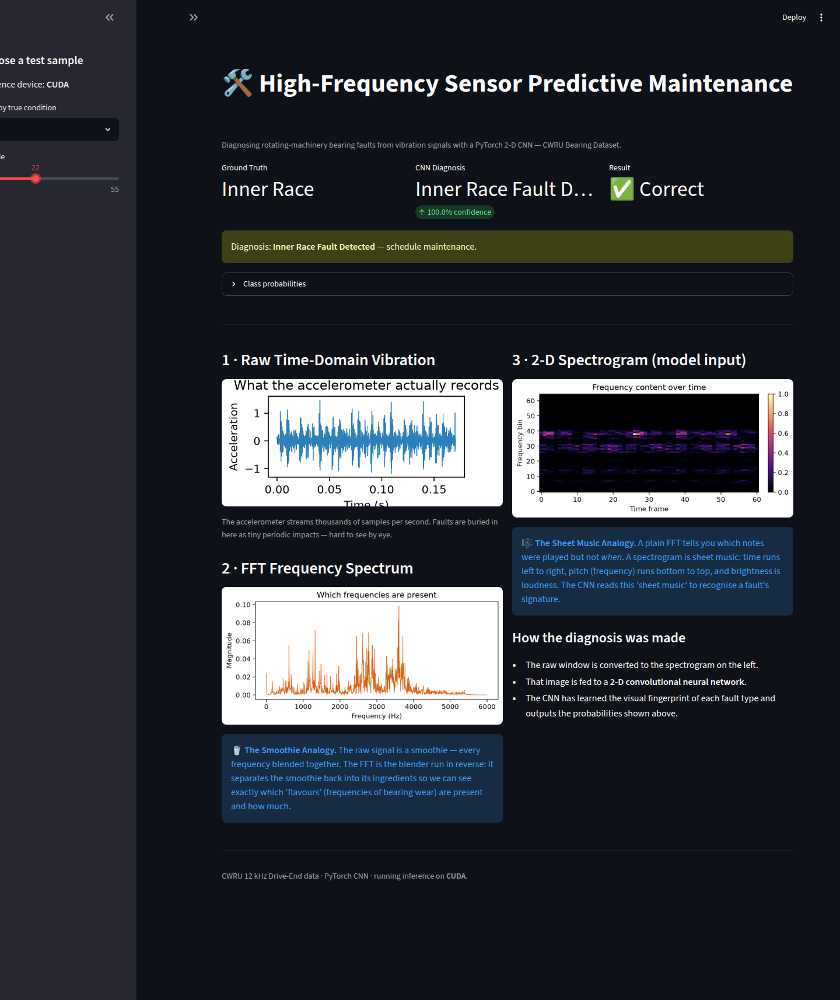
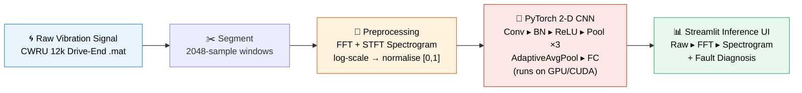
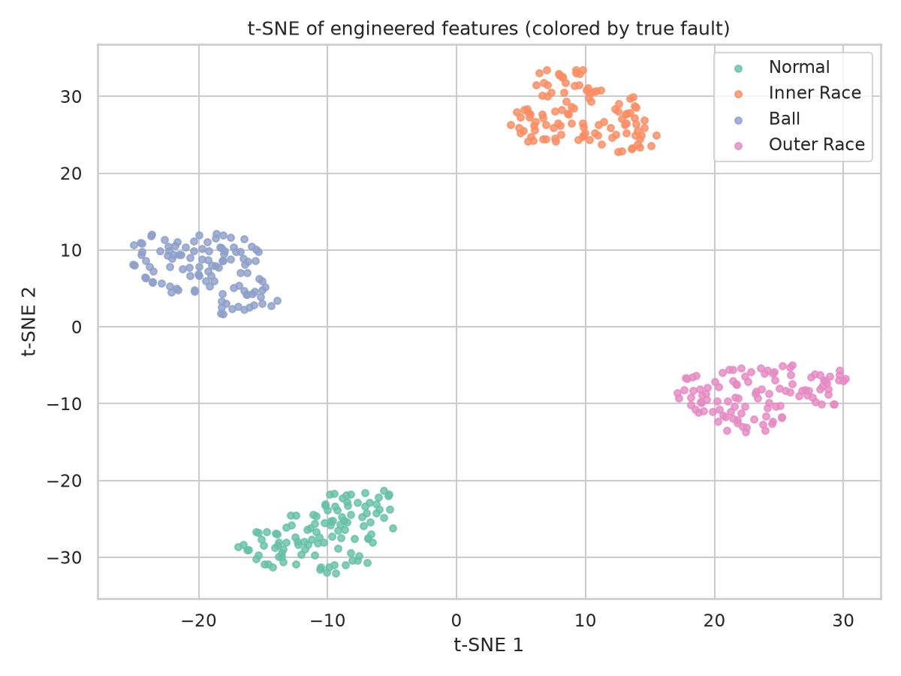
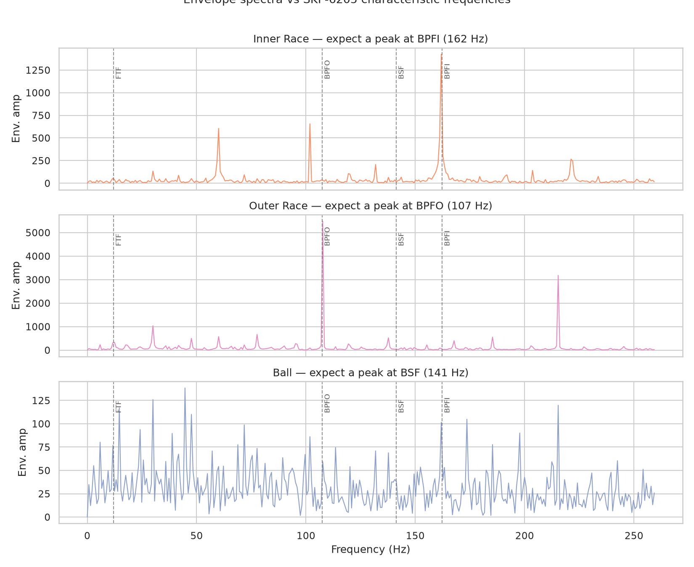

# 🛠️ High-Frequency Sensor Predictive Maintenance with PyTorch & Streamlit

> Diagnosing rotating-machinery bearing faults from raw vibration signals using a
> 2-D Convolutional Neural Network — from a `.mat` file to a live, explainable
> dashboard.

<p align="left">
  <a href="https://2vcmmt4mqfryhgfbqw9xmk.streamlit.app/"></a>
  
  
  
  
</p>

<p align="center">
  <a href="https://2vcmmt4mqfryhgfbqw9xmk.streamlit.app/"></a>
  <br>
  <sub>The Streamlit dashboard running <b>live GPU inference</b>: raw signal → FFT → spectrogram → CNN diagnosis, with plain-language analogies.</sub>
</p>

> 📖 **Prefer the story?** Read the narrative write-up —
> **[“Teaching a Neural Network to Hear a Failing Bearing”](blog/medium_article.md)**
> (why hitting 100% accuracy made me trust the model *less*).

---

## 🏭 The Problem — Why Predictive Maintenance?

In oil & gas, power generation, and heavy industry, the machines that matter most —
pumps, compressors, turbines, gearboxes — all spin on **bearings**. When a bearing
starts to fail, it doesn't fail politely. A cracked race or a spalled ball can take
a multi-million-dollar compressor offline, halt a production line, or create a
genuine **safety hazard**.

There are three ways to handle this:

| Strategy | What it means | The cost |
|---|---|---|
| **Reactive** | Fix it after it breaks | Catastrophic downtime, safety risk |
| **Preventive** | Replace on a fixed schedule | Wasted parts, unnecessary shutdowns |
| **Predictive** ✅ | Fix it *just before* it breaks | Minimal downtime, maximal safety |

**Predictive maintenance (PdM)** listens to a machine's vibrations and catches the
faint signature of a fault *weeks before* a human would feel or hear it. This project
builds that listening system end-to-end.

---

## 💡 The Solution

A four-stage pipeline that turns a stream of accelerometer numbers into an
actionable diagnosis:

```
Vibration sensor  ─▶  Time–Frequency Transform  ─▶  2-D CNN (GPU)  ─▶  Diagnosis UI
   (raw .mat)          (FFT / Spectrogram)          (PyTorch)         (Streamlit)
```

1. **Data ingestion** — pull real, labelled bearing-failure recordings from the
   Case Western Reserve University (CWRU) Bearing Data Center.
2. **Time–frequency transformation** — convert each slice of signal into a
   *spectrogram*: a picture of how its frequency content evolves over time.
3. **2-D CNN classification** — a convolutional neural network reads those pictures
   and recognises the visual fingerprint of each fault.
4. **Explainable UI** — a Streamlit dashboard shows the raw signal, the FFT, the
   spectrogram, and the model's verdict, with plain-English explanations.

The model classifies four conditions:

| Label | Condition |
|:---:|---|
| 0 | **Normal** (healthy) |
| 1 | **Inner Race** fault |
| 2 | **Ball** fault |
| 3 | **Outer Race** fault |

---

## 🧠 Theory Explained Simply (Recruiter-Friendly)

You don't need a signal-processing degree to get the intuition. Two analogies do
all the heavy lifting.

### 🥤 The Fast Fourier Transform (FFT) — *The Smoothie Analogy*

A raw vibration signal is like a **smoothie**: strawberry, banana, and spinach all
blended into one. By looking at the smoothie you can't tell exactly what went in.

The **FFT is a magic blender run in reverse.** Feed it the smoothie and it hands
back the individual ingredients — *"30% strawberry, 50% banana, 20% spinach."*

For a bearing, those "ingredients" are **frequencies**. A healthy bearing has one
recipe; an inner-race fault adds a specific new "flavour" (a characteristic fault
frequency). The FFT lets us read the recipe and spot the ingredient that shouldn't
be there.

### 🎼 The Spectrogram — *The Sheet Music Analogy*

The FFT has one blind spot: it tells you **which** frequencies are present, but not
**when**. Imagine being told a song contains a C, an E, and a G — but not the order
or rhythm. You can't recognise the tune.

A **spectrogram is sheet music.** It puts the notes back on a timeline:

- **Left → right** = time
- **Bottom → top** = pitch (frequency)
- **Brightness** = loudness (energy)

Now a fault isn't just "a frequency" — it's a *pattern of impacts repeating over
time*, exactly the kind of 2-D structure a **CNN** (the same tech that recognises
cats in photos) is brilliant at spotting. That's why we hand the CNN a picture, not
a number.

---

## 🏗️ Technical Architecture



**Model (`BearingCNN`):** three `Conv2d → BatchNorm → ReLU → MaxPool` blocks
(16 → 32 → 64 channels), an `AdaptiveAvgPool2d(4×4)` head, dropout, and a small
fully-connected classifier. The adaptive pooling means the network doesn't care
about the exact spectrogram dimensions — change the STFT settings and it still works.

---

## 📊 Exploratory Data Analysis

Before reaching for a bigger model, **understand the signal**. The full analysis
lives in **[`notebooks/01_eda.ipynb`](notebooks/01_eda.ipynb)** (the backbone of the
[narrative article](blog/medium_article.md)); highlights:

- **Descriptive:** faults are *impulsive* — visible as periodic spikes, fat-tailed
  amplitude distributions, and extra high-frequency energy vs the smooth Normal trace.
- **Engineered features:** standard condition-monitoring statistics (RMS, **kurtosis**,
  **crest / impulse / clearance factors**) plus envelope-spectrum energy. A
  **RandomForest on these hand-crafted features alone scores 1.000** on the
  leakage-free split — quantifying just how *easy* the single-condition task is.
- **Separability (t-SNE):** the four classes form clean, non-overlapping clusters —
  a visual explanation for why *any* competent model nears 100%.
- **Physics check (envelope analysis):** the CWRU bearing is an **SKF 6205**, so its
  defect frequencies are known. Envelope spectra peak exactly where the fault type
  predicts — **Inner Race → BPFI (162 Hz)**, **Outer Race → BPFO (107 Hz)** —
  evidence the signal carries genuine, explainable diagnostic content (Ball faults
  are subtler, as expected). Engineered features live in `src/features.py`.

|  |  |
|:--:|:--:|
| Classes are trivially separable at one operating condition | Envelope peaks match SKF-6205 defect frequencies |

---

## 🔬 Evaluation Methodology — Why These Numbers Are Honest

A naïve take on this dataset will report ~100% accuracy and quietly mislead you.
Each fault class is a **single continuous recording**, which sets three traps this
project deliberately avoids:

1. **Leakage-free splitting.** Segmenting with overlap and then splitting segments
   *randomly* leaks near-duplicate windows across train/test. Instead we split each
   *raw signal by time* (with a guard gap) **before** segmenting, so no window is
   shared across splits.
2. **Validation set + early stopping.** A 3-way train/val/test split; we stop on
   validation loss and report on a never-touched test set.
3. **k-fold cross-validation.** 5 leakage-free folds for a stable estimate, not a
   single lucky split.

**Result (single operating condition): leakage-free 5-fold CV = `1.000 ± 0.000`.**

The takeaway is *not* "100% is great." It's the opposite kind of insight: once
window-overlap leakage is removed, the residual difficulty is the **operating
condition** itself. At one fixed load/RPM the four fault signatures are stationary
and trivially separable in a spectrogram — so a perfect score here reflects an
*easy benchmark*, not a finished product. Tellingly, the leakage-free training
curve now exposes real overfitting in early epochs (train acc `1.000` while
validation sits at chance `0.250`) that the old random split completely hid.

### Cross-load generalization — the harder benchmark

The deployment-relevant question is whether the model survives a **change of
operating condition**. CWRU recorded each fault at four motor loads (0–3 HP,
~1797 → 1730 RPM), so we can run **leave-one-load-out**: train on three loads and
test on a load the network *never saw*. Train and test windows now come from
physically different recordings, so this is a genuine distribution shift, not just
a clean split.

```bash
python src/downloader.py --all-loads   # fetch all 16 files (4 classes x 4 loads)
python src/model.py --cross-load       # leave-one-load-out benchmark
```

| Held-out load | Test accuracy | Per-class recall |
|:---:|:---:|:---|
| 0 HP | `1.000` | all classes 1.00 |
| 1 HP | `1.000` | all classes 1.00 |
| 2 HP | `1.000` | all classes 1.00 |
| 3 HP | `1.000` | all classes 1.00 |
| **Mean** | **`1.000 ± 0.000`** | |

The honest — and slightly surprising — result: **load transfer is *not* the
bottleneck for fault-*type* identification.** It even holds when you train on a
*single* load and test on the most distant one (`train{0 HP} → test{3 HP} = 0.998`).
The reason is physical: a bearing's defect frequencies are set by its *geometry*
(BPFI/BPFO/BSF), which barely moves across this ~4% RPM range, and the per-segment
min-max normalisation strips away the amplitude differences load *does* cause. What
survives is the fault-frequency *pattern* — and that's exactly what the CNN keys on.

So the genuinely unsolved benchmarks are **severity grading** (0.007″ vs 0.014″ vs
0.021″ of the *same* fault) and **real-world noise / multi-fault** signals — not
load transfer. That reframing is itself a useful solutioning result: it tells you
where *not* to spend modelling effort.

```bash
python src/evaluate.py                 # confusion matrix + per-class F1
python src/model.py --split random     # the leaky baseline, for contrast
```

---

## ⚙️ Setup & Usage

### 1. Install

```bash
git clone https://github.com/godot107/predictive-maintenance-cwru.git
cd predictive-maintenance-cwru

# torch is a heavy dependency — a project-local venv is recommended
python -m venv .venv
source .venv/bin/activate          # Windows: .venv\Scripts\activate

pip install -r requirements.txt
```

> **GPU users:** for a CUDA build of PyTorch, install it per the
> [official selector](https://pytorch.org/get-started/locally/) before the line
> above, e.g. `pip install torch torchvision --index-url https://download.pytorch.org/whl/cu121`.

### 2. Download the dataset

```bash
python src/downloader.py
```

Fetches four CWRU `.mat` recordings (Normal, Inner Race, Ball, Outer Race) into
`data/`. Existing files are skipped.

### 3. Train the model

```bash
python src/model.py --epochs 50        # leakage-free split + early stopping
python src/model.py --cv 5             # optional: 5-fold cross-validation
```

Trains `BearingCNN` on the spectrograms with a validation set and **early stopping
on validation loss**, then reports accuracy on a never-touched test set and saves
the best weights to `models/bearing_cnn.pth`. Automatically uses CUDA if available.

### 4. Evaluate honestly

```bash
python src/evaluate.py                 # confusion matrix + per-class F1 -> reports/
```

### 5. Launch the dashboard

```bash
streamlit run src/app.py
```

Pick any test sample and watch it flow through the pipeline — raw signal, FFT,
spectrogram, and the CNN's live diagnosis with confidence scores.

### 6. Deploy it (Streamlit Community Cloud)

The repo is deploy-ready: the trained weights (630 KB) ship in `models/`, the app
**auto-downloads the dataset on first run**, and `requirements.txt` pulls the
CPU-only PyTorch wheel so it installs cleanly on a free CPU host.

1. Push this repo to your own GitHub account.
2. Go to **[share.streamlit.io](https://share.streamlit.io)** and sign in with GitHub.
3. **Create app → Deploy a public app from GitHub**, then set:
   - **Repository:** your fork
   - **Branch:** `main`
   - **Main file path:** `src/app.py`
4. Click **Deploy**. The first build installs deps and downloads the CWRU files
   (~12 MB); subsequent loads are instant. Inference runs on CPU in the cloud.

> **🚀 Live demo:** **[Open the dashboard on Streamlit Cloud ▶](https://2vcmmt4mqfryhgfbqw9xmk.streamlit.app/)**
> _(free tier — if it's been idle it may take ~30 s to wake up)._

---

## 📂 Project Structure

```
predictive-maintenance-pdm/
├── src/
│   ├── downloader.py   # CWRU dataset fetch + registry (4 classes x 4 motor loads)
│   ├── preprocess.py   # segmentation, FFT, STFT spectrograms, leakage-free + cross-load splits
│   ├── features.py     # engineered vibration features + SKF-6205 envelope physics
│   ├── model.py        # BearingCNN + training (early stopping) + k-fold CV + cross-load benchmark
│   ├── evaluate.py     # confusion matrix + per-class precision/recall/F1
│   └── app.py          # Streamlit dashboard (auto-downloads data on first run)
├── notebooks/
│   └── 01_eda.ipynb    # exploratory data analysis (Medium-article backbone)
├── blog/
│   └── medium_article.md   # narrative write-up for Medium / a personal blog
├── .streamlit/
│   └── config.toml     # dashboard theme (for Streamlit Community Cloud)
├── data/               # downloaded .mat files (git-ignored)
├── models/             # bearing_cnn.pth — committed so the deploy runs out-of-the-box
├── reports/            # generated figures (key ones committed for the README)
├── requirements.txt        # runtime deps (CPU-torch, deploy-ready)
├── requirements-dev.txt    # + jupyter/seaborn for the EDA notebook
└── README.md
```

---

## 📚 Further Resources

- **3Blue1Brown — *But what is the Fourier Transform? A visual introduction*:**
  https://www.youtube.com/watch?v=spUNpyF58BY — the single best intuition-builder
  for the math behind the Smoothie Analogy.
- **CWRU Bearing Data Center (dataset & documentation):**
  https://engineering.case.edu/bearingdatacenter
- **PyTorch CNN tutorial:**
  https://pytorch.org/tutorials/beginner/blitz/cifar10_tutorial.html
- **`scipy.signal.spectrogram` reference:**
  https://docs.scipy.org/doc/scipy/reference/generated/scipy.signal.spectrogram.html

---

## 🔭 Where This Goes Next (Solutioning Notes)

This repo is a *proof of capability*, not a shipped product. In a real energy-sector
deployment the same pipeline would extend to:

- **Severity grading** across the fault diameters CWRU provides (0.007″–0.028″) —
  *the* genuinely hard benchmark now that cross-load type-ID is solved (see above):
  telling a small defect from a large one of the *same* fault type.
- **Real-world noise & multi-fault** signals — CWRU is a clean single-fault test rig;
  field data is noisier and faults co-occur.
- **Streaming inference** on live PLC / IIoT sensor feeds instead of static files.
- **Remaining Useful Life (RUL)** regression, not just fault classification.
- **Edge deployment** (ONNX / TensorRT) so inference runs next to the asset.

---

## 📄 Data & License

- **Dataset:** [CWRU Bearing Data Center](https://engineering.case.edu/bearingdatacenter).
  The `.mat` recordings are downloaded at runtime and are **not** redistributed here;
  please cite CWRU if you use the data.
- **Code:** released under the [MIT License](LICENSE).

---

<sub>Built as a portfolio piece demonstrating an end-to-end AI solution: data
engineering, signal processing, deep learning, honest evaluation, and an explainable
UI — the full arc of an **AI Solutioning Consultant** engagement.</sub>
