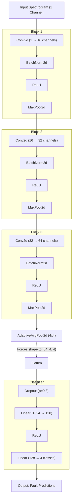

# Teaching a Neural Network to Hear a Failing Bearing

### How I built an end-to-end predictive-maintenance pipeline — and why hitting 100% accuracy made me trust it *less*

---

Walk through any refinery, power plant, or pump station and you're surrounded by
machines that spin: motors, compressors, turbines, gearboxes. Almost all of them
ride on **bearings** — and when a bearing starts to fail, it doesn't send a calendar
invite. A cracked race or a spalled ball can take a multimillion-dollar compressor
offline in minutes, halt a production line, or turn into a genuine safety incident.

The good news: a failing bearing **whispers before it screams**. Long before a human
can hear or feel anything, the vibration signature changes in tiny, repeating ways.
**Predictive maintenance (PdM)** is the art of listening for those whispers. This is
the story of building a system that does exactly that — and of a plot twist that
taught me more than the model did.

> *This article is the narrated version of a project on GitHub:
> [github.com/godot107/predictive-maintenance-cwru](https://github.com/godot107/predictive-maintenance-cwru).
> Everything here is reproducible from that repo.*

---

## The data: four bearings, four fates

I used the **Case Western Reserve University (CWRU) Bearing Dataset**, a benchmark in
the condition-monitoring world. An accelerometer sampled at 12 kHz records the
vibration of a motor's drive-end bearing under four conditions:

- **Normal** (healthy)
- **Inner Race** fault
- **Ball** fault
- **Outer Race** fault

The goal: feed the model a slice of raw vibration and have it name the fault.

But you can't just throw a wiggly line at a neural network and hope. The signal has
to be transformed into something a network can *see*. That's where two analogies make
everything click.

---

## Two analogies that make signal processing click

### 🥤 The Fourier Transform is a smoothie un-blender

A raw vibration signal is like a **smoothie**: strawberry, banana, and spinach all
blended into one. Looking at the smoothie, you can't tell what went in.

The **Fast Fourier Transform (FFT)** is a magic blender run in reverse. Pour in the
smoothie and it hands back the ingredients — *"30% strawberry, 50% banana, 20%
spinach."* For a bearing, those ingredients are **frequencies**, and a fault adds a
specific new "flavour" that shouldn't be there.

#### How it works in code (and physics)

Physically, when a bearing is healthy, it hums along at a smooth, predictable baseline. But when a crack forms on the inner race, every time a ball bearing rolls over that crack, it creates a tiny microscopic "click" or impact. Because the motor is spinning at a constant speed, these clicks happen at a very regular interval (a specific frequency). 

The FFT takes the messy, noisy vibration wave and mathematically isolates that exact repeating "click", plotting it as a giant spike on a graph. In Python, isolating these frequencies is incredibly elegant using NumPy's real-valued FFT (`rfft`):

```python
import numpy as np

# 'segment' is a slice of our raw vibration array
# 'fs' is our sampling rate (12,000 Hz)
n = len(segment)

# 1. Get the X-axis (the exact frequency values in Hz)
frequencies_hz = np.fft.rfftfreq(n, d=1.0 / fs)

# 2. Get the Y-axis (the magnitude/loudness of each frequency)
magnitude = np.abs(np.fft.rfft(segment)) * (2.0 / n)
```

Average the FFT across many windows and the fingerprints jump out — the faults light
up high-frequency bands the healthy bearing never touches:


### 🎼 A spectrogram is sheet music

The FFT has a blind spot: it tells you *which* notes were played, but not *when*.
Imagine being told a song contains a C, an E, and a G — but not the rhythm. You'd
never recognize the tune.

A **spectrogram** puts the notes back on a timeline. It's sheet music: time runs left
to right, frequency runs bottom to top, brightness is loudness. Now a fault isn't a
single frequency — it's a *pattern of impacts repeating over time*, exactly the kind
of 2-D structure a **Convolutional Neural Network** (the tech that recognizes cats in
photos) is built to spot.

So the high-level pipeline became:

```text
Raw vibration  ─▶  Spectrogram  ─▶  2-D CNN (on GPU)  ─▶  Fault diagnosis
```

#### Under the Hood: The CNN Architecture

To make the "2-D CNN" step concrete, here is the exact dataflow of the model. It's a lightweight, 3-block architecture (only ~155,000 parameters) that uses an Adaptive Average Pooling layer. This pooling layer is a crucial design choice: it forces the feature map to a fixed 4x4 size before the classifier, meaning the network won't break if you feed it slightly different sized spectrograms.



<!-- Publishing to Medium? Medium can't render Mermaid — paste the exported image
     instead: reports/cnn_architecture.png (regenerate any time via mermaid.ink). -->

**Design Consideration: Avoiding the "Matrix Mismatch" Error**

If you are new to building CNNs, the hardest part is usually preventing `RuntimeError: shape cannot be multiplied` when transitioning from Convolutional layers to Linear layers. This architecture solves that using two rules:
1. **The Plumbing Rule:** When stacking `Conv2d` layers, only the *channels* (depth) need to connect perfectly. Notice how Block 1 outputs 16 channels, and Block 2 takes in 16 channels. It's like plumbing—the output pipes must match the input valves.
2. **The "Cheat Code" (Adaptive Pooling):** `MaxPool2d` halves the height and width of the spectrogram at every block. Normally, you have to manually calculate the exact final grid size to feed into the `Linear` layer. If your input image changes size, the math breaks and the code crashes. By inserting `AdaptiveAvgPool2d((4, 4))` right before flattening, we tell PyTorch: *"I don't care what the height and width are at this point. Mathematically squish whatever you have into a 4x4 grid."* This permanently locks our flattened size to exactly 64 channels × 4 × 4 = 1024, completely eliminating shape mismatch errors.

> ***Academic Credit:** The math that makes "Adaptive Pooling" possible—allowing CNNs to accept images of any size without breaking the fully connected layers—was pioneered by Kaiming He et al. in the landmark 2014 paper [Spatial Pyramid Pooling in Deep Convolutional Networks for Visual Recognition](https://arxiv.org/abs/1406.4729). Furthermore, the practice of heavily pooling spatial dimensions to drastically reduce the parameter count of Linear layers was famously introduced by Lin et al. in the 2013 paper [Network In Network](https://arxiv.org/abs/1312.4400).*

I wired it up in PyTorch, trained on an NVIDIA GPU, and wrapped it in a Streamlit
dashboard that shows the raw signal, the FFT, the spectrogram, and the model's live
verdict. It worked. The test accuracy came back at **100%**.


And that's where the project got interesting.

---

## The plot twist: when 100% is a red flag

A perfect score should make you *suspicious*, not proud. Real-world classifiers don't
hit 100% — so either the problem is trivially easy, or something is leaking.

Classic overfitting looks like **high training accuracy, low test accuracy** — a gap.
But here training *and* test were both ~100%, with no gap. That pointed at the second
culprit: **data leakage**.

Here was the bug in my evaluation. Each fault class is one long continuous recording.
I chopped it into overlapping windows and then split those windows **randomly** into
train and test. Because the windows overlapped, near-duplicate slices ended up on
*both* sides of the split. The model wasn't generalizing — it was recognizing windows
it had half-seen in training. The test set was lying to me.

So I rebuilt the evaluation the way it should have been done from the start:

1. **Leakage-free splitting** — cut each *raw recording* into train/validation/test
   spans **by time** (with a guard gap) *before* windowing, so no slice is shared.
2. **A validation set + early stopping** — stop on validation loss, report on a test
   set the model never touched.
3. **5-fold cross-validation** — for a stable estimate instead of one lucky split.

The payoff was immediate and humbling. With honest splitting, the early training
epochs now showed **training accuracy at 1.00 while validation sat at 0.25 — random
chance.** That genuine overfitting had been completely *hidden* by the leaky split.
The methodology upgrade was doing real work.

---

## The deeper twist: it was *still* 100%

Here's what I didn't expect. Even after removing every trace of leakage, and across
all five cross-validation folds, the score held: **1.000 ± 0.000**.

So leakage wasn't the main story. To understand why, I did what I should have done
*first*: I stopped modeling and **explored the data**.

I computed a set of classic vibration features (RMS, **kurtosis**, crest factor — all
interpretable measures of how "impulsive" a signal is) and projected them to two
dimensions with t-SNE. The picture explains everything:


Four clean, perfectly separated clusters. At a *single operating condition* — one
load, one speed — each fault's signature is so distinct that the classes barely
overlap. To prove the point, I trained a plain **Random Forest** on those hand-crafted
features (no deep learning at all). It also scored **1.000**.

The lesson: **100% wasn't a triumph of my model — it was a sign the benchmark was
easy.** And knowing the difference is the whole job.

---

## Asking the bearing to confirm its own diagnosis

There was one more thing I wanted: proof the model was learning *real physics*, not an
artifact. Bearing engineering gives us a beautiful test.

The CWRU drive-end bearing is an **SKF 6205**, and its geometry fixes the exact
frequencies at which each defect "rings" — the ball-pass frequencies of the outer race
(BPFO), inner race (BPFI), and so on, all set by the shaft speed. Using **envelope
analysis** (the demodulation technique vibration engineers actually use), I extracted
the impact-repetition rate from each fault and checked it against theory:


The peaks land exactly where the physics predicts: the **Outer Race** fault rings at
**BPFO (107 Hz)**, the **Inner Race** fault at **BPFI (162 Hz)**. The signal carries
genuine, explainable diagnostic content — and, honestly, the **Ball** fault is the
subtle one, with a weak envelope signature, which is precisely what bearing theory
says to expect. Even the exceptions agreed with the textbook.

---

## What this project actually demonstrates

The deliverable people *see* is a dashboard that classifies bearing faults. The
deliverable that matters is the **judgment** around it:

- **Engineering it end-to-end** — data ingestion, signal processing, a GPU-trained
  CNN, and an explainable UI.
- **Distrusting a good result** until the evaluation earns that trust — and knowing
  that leakage, not the model, is usually the thing to interrogate first.
- **Explaining it in plain language** — to a recruiter with a smoothie, to an engineer
  with an envelope spectrum.

That last part is the heart of an **AI Solutioning Consultant's** job: translating
between the business problem ("don't let the compressor fail") and the technical
reality ("here's what the data can and can't tell us, and here's how I know").

So I ran the benchmark I'd been saving for last — the genuinely *hard* one:
**cross-load generalization**. CWRU recorded each fault at four motor loads, so I
trained on three and tested on a load the model had never seen — a true change of
operating condition, not just a clean split. I expected the accuracy to finally crack.

It didn't. Leave-one-load-out held at **1.000 ± 0.000**, and even training on a
*single* load and testing on the most distant one stayed at **0.998**. The physics
explains it: a defect's frequencies are fixed by the bearing's *geometry*, which
barely shifts across this ~4% speed range, while the per-window normalization removes
the amplitude changes the load *does* cause. What survives is the fault-frequency
*pattern* — exactly what the CNN keys on. Load transfer simply isn't the bottleneck
for naming the fault *type*.

So the genuinely open problems lie elsewhere: **severity grading** (telling a 0.007″
defect from a 0.021″ one of the *same* fault type) and noisy, multi-fault field data.
Knowing *where* the difficulty actually lives — and where it doesn't — turned out to be
the most useful thing the whole exercise produced. It's the next milestone in the repo.

---

## Try it yourself

- **Code & full write-up:** [github.com/godot107/predictive-maintenance-cwru](https://github.com/godot107/predictive-maintenance-cwru)
- **Dataset:** [CWRU Bearing Data Center](https://engineering.case.edu/bearingdatacenter)
- **The best 20 minutes on Fourier transforms:** [3Blue1Brown](https://www.youtube.com/watch?v=spUNpyF58BY)

If you take one thing from this: when your model scores 100%, don't celebrate —
*investigate*. The most valuable result in this whole project was the one that looked
too good to be true.

---

## Appendix: Glossary of Terms

If you're new to the signal processing or machine learning terminology used in this article, here is a quick guide to help clarify the concepts:

- **Predictive Maintenance (PdM)**: The practice of continuously monitoring equipment condition (like vibration or temperature) to predict when it will fail. This allows maintenance to be scheduled right before failure, avoiding both unexpected breakdowns and unnecessary routine part replacements.
- **Fast Fourier Transform (FFT)**: A mathematical algorithm that takes a raw signal measured over time (like a complex vibration wave) and breaks it down into the individual frequencies that make it up. Think of it as a recipe that tells you exactly how much of each "pitch" is in a sound.
- **Spectrogram**: A visual representation of frequencies as they change over time. If an FFT gives you the specific notes played in a single chord, a spectrogram is the sheet music for the entire song, showing when each note is played and how loud it is.
- **Data Leakage**: A fundamental mistake in machine learning where the model accidentally has access to the test data during training. In this project's initial approach, overlapping time windows were randomly split, meaning near-identical slices ended up in both the training and test sets. The model essentially "memorized" the answers rather than learning to generalize.
- **t-SNE (t-Distributed Stochastic Neighbor Embedding)**: A technique used to visualize highly complex data by grouping similar data points together on a 2D map. In this article, it visually proves that the different bearing faults are so mathematically distinct that they form their own isolated "islands," explaining why the model easily scored 100%.
- **Envelope Analysis (Demodulation)**: A signal processing technique that strips away the loud, high-frequency "carrier" noise of a machine to isolate and reveal the quieter, lower-frequency repeating impacts—such as a bearing ball repeatedly hitting a crack on the inner race.
- **Cross-load Generalization (Cross-load Benchmark)**: The process of training a model on data from a machine operating under one set of conditions (e.g., a 1 horsepower load) and testing it on data from a different condition (e.g., 2 or 3 horsepower). Because machine vibrations inherently change under different physical loads, testing "cross-load" proves whether the model actually learned the physics of a failure, or if it just overfit to the exact sound of a 1 HP motor.
